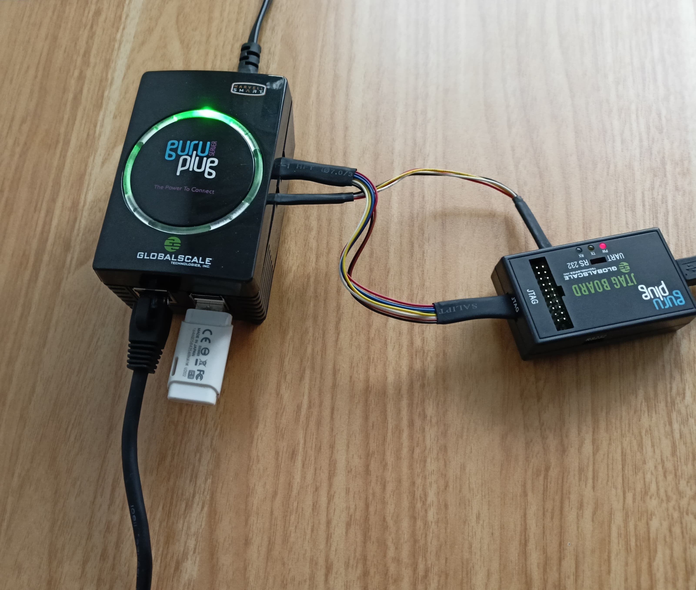

# Guruplug



## Goals

- [x] Update OS to Debian 12
- [x] Boot from SD card or USB
- [x] Update old mirrors Debian 5
- [ ] Cross platform compilation for ARM 32 bits armel
- [x] Little frontend for storing GuruPlug docs
- [ ] Connect to device using bluetooth
- [ ] Learn to use JTAG
- [x] Learn to set up serial console tty using JTAG
- [x] Tethering with phone
- [ ] Use as UAP
- [x] Recover from bricked state
- [x] Upgrade U-Boot
- [ ] Pihole guruplug

## Launch server with documentation

### Setup

```console
python3 -m venv venv &&
source venv/bin/activate &&
pip install -r requirements.txt
```

### Run MKdocs server

```console
mkdocs serve -a 0.0.0.0:8000
```


## What was learnt from this experience

- 